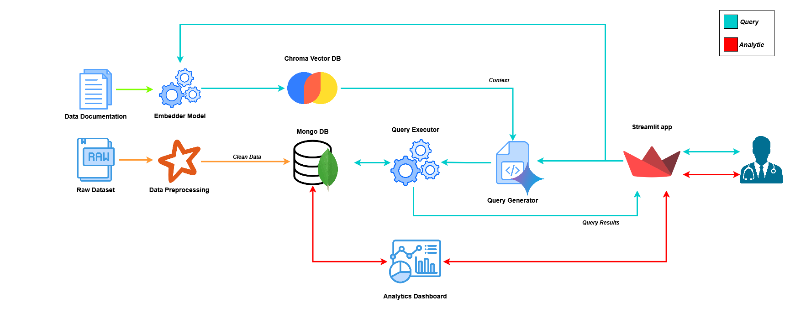

# LLM2Query

## 1. Statement Problem
The medical field, particularly **cardiology**, generates an immense amount of complex and often unstructured data. Physicians spend a significant amount of time manually navigating and extracting relevant information from these datasets, which slows down the decision-making process and reduces efficiency. Rapid and intuitive access to specific data is crucial for timely diagnoses and effective treatments.

Our prototype aims to address this challenge. The goal is to minimize the time cardiologists spend retrieving relevant information from databases, allowing them to focus more on analysis and patient care. 

### 1.1 Dataset
For the development and testing of the prototype, we utilized a **real-world dataset** comprising anonymized patient information collected from various medical visits in the Campania region of Italy. This dataset, while sensitive in nature, has been crucial for training and validating our system's ability to process and query diverse medical records relevant to cardiology. The variety of visit types within the dataset ensures robust testing across different clinical scenarios.

## 2. Our Solution 
The objective is to democratize access to complex information contained within medical databases through a **natural language interface**.

Our solution is built upon a **modular and scalable architecture**, designed to interpret cardiologists' natural language queries and translate them into executable interrogations on a MongoDB database. In order to achieve this goal, our system leverages a sophisticated query construction engine powered by **Google's Gemini API**, combined with a **Retrieval Augmented Generation** (RAG) approach. This integration allows for highly accurate interpretation of nuanced medical queries and the generation of precise **MongoDB query language** (MQL).

🟠 Orange Flow: Data Preprocessing and Ingestion
This flow represents the initial stage of data preparation and ingestion. Raw medical data is rigorously preprocessed using PySpark for cleaning, transformation, and standardization. The refined dataset is then efficiently loaded into our MongoDB database, forming the foundation for all subsequent queries.

🔵 Cyan Flow: Natural Language Query Processing
This flow outlines how user natural language queries are transformed into executable MongoDB queries.

* Query Embedding & Retrieval: The user's natural language query is converted into embeddings. These embeddings are then used to retrieve the most relevant dataset descriptions (documents containing schema and data context) from our knowledge base.
* LLM Query Generation (RAG): The top three most relevant documents are provided as context to our LLM (powered by Gemini API). Leveraging a Retrieval Augmented Generation (RAG) approach, the LLM then generates a precise MongoDB query based on the user's input and the retrieved context.
* Query Validation & Execution: The generated query undergoes a validation check by our query engine before being executed on the MongoDB database to retrieve the desired results.

🔴 Red Flow: Pre-built Analytics and User Interaction
This flow describes how users can access and interact with pre-defined analytical views within the system.

* User Selection: Through a Streamlit interface, users can select various pre-built analytical options.
* Data Retrieval & Presentation: Based on the user's choices, the system executes specific MongoDB queries to retrieve the necessary data. This data is then visualized and presented to the user via the Streamlit interface, providing immediate insights without the need for natural language querying.

